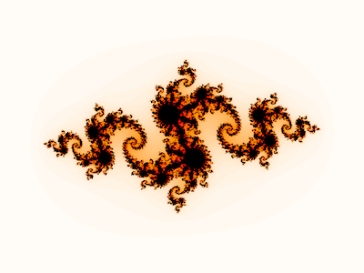
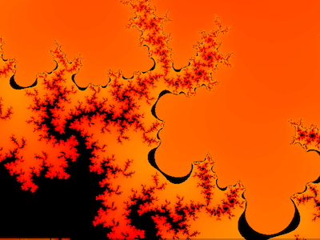
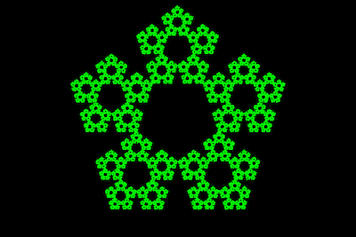
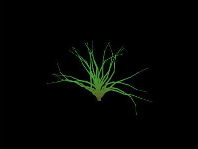

# Introduction to Digital Art and Sciences.

A collection of Java implementation of generative art.

## Descriptions

### HW01
"Drunken walk" or sketches generated using random generator on the following topologies

* Toplogies include:
 * Infinitive plane
 * Bounded plane
 * Trtorial plane

### HW02
Created gradients using bilinear interpolation with BufferedImage Class.

### HW03
"Implemented crystal like sketches using diffusion limited aggregation algorithm"

### HW04
Implemented a photo filter effect for making "opArt".

### HW05
Generate a random walk plant algorithm, display the final image base on user inputs

### HW5a
Modify your HW #05 solution so that...the color,brushstroke,will smoothly interpolate from the root of the plant to the tip of the plant.

### HW5b
Modify your HW #05a so that it animates the plant's growth (as described in lecture). Generate each animation frame on a worker thread, not the EDT.

### HW07
For this assignment you shall be implementing one of the Affine Transform Fractal techniques described in lecture: MRCM or IFS.

### HW08
Implemented L-System algorithm to generate fractals.

## HW09
For this assignment you shall be implementing a Mandelbrot set and Julia set explorer, implement zooming and recalculate the fractal everytime zoom is pressed.

## HW10
For this assignment you shall be implementing a Mandelbrot set and Julia set explorer with animated (un)zooming.

### HW11
For this assignment you shall be implementing Conway's Game of Life.
